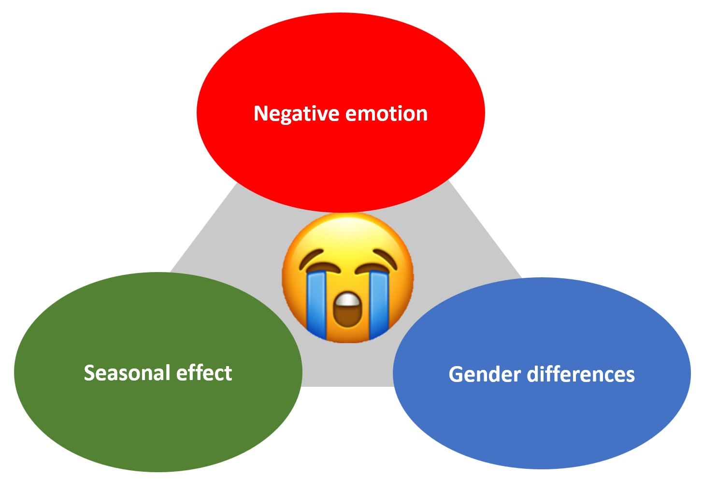

Throughout the decade, depression has become a common mental disorder worldwide with a growing of affected population. As indicated by WHO, approximately 3.8% of population, 280 million, suffered from depression. Among all, 10.7% of adults and 15% of young people has reported depressive emotion, with 70% of them take anxiety and depression as their major problems in US. 

As depression is one of the priority conditions covered by WHO for its severeness and high prevalence rate, we would like to focus our research on analysis of the potential factors that affect depression.

## How can we tell depression?
A growing body of evidence shows that people in negative mood use language differently. Many studies have unveiled a class of words that can help accurately detect whether someone is in negative emotions. Furthermore, mental disorders have been found to be positively associated with temperature. Moreover, gender differences were expected for different emotion and social process words, and overall word use. 

Under this context, we have applied **sentiment analysis** to automatically sort text data from Quotebank by positive, negative, and neutral sentiments. The further goals of our project are the following, also shown in Fig.1.
1. Analyze the trend of negative experience
2. Analyze the seasonal effect on negative emotions
3. Analyze gender effect on negative emotions

## Method
To look into this topic, we analyzed the dataset from [Quotebank](https://quotebank.dlab.tools/search?target=quotation&text=the&from_date=2008-09-01&to_date=2020-04-17), which is a corpus of quotations from a decade of news. We mainly focused on the data from 2015 to 2019(excluding 2016 since the data in 2016 is not equally distributed in each month) and in 2020, it only covers until April. To perform sentiment analysis, we applied two libraries, **[TextBlob](https://pypi.org/project/textblob/0.9.0/)** and **[gender-guesser](https://pypi.org/project/gender-guesser/)**, to analyze the dataset. 

TextBlob is a Python library for prossing textual data, is useful for sentiment analysis by a pre-defined dictionary classifying negative and positive words. TextBlob assigns a score, between [-1, 1] to each word in a sentence, then by operations, for example, multipys and takes average, to get the final results. TextBlob returns polarity and subjectivity of a sentence which we can further analyze. Gender-guesser predicts the gender of a given first name with six different output: unknown (name not found), andy (androgynous), male, female, mostly_male, or mostly_female. In our project, we take male and mostly_male as man, female and mostly_female as women, while discard the data that gives output as unknown and andy.

For all the analysis, we randomly collect 1 million quotes from 2017, 2018, and 2019 for 30 times to decrease bais and variation. A schematic diagram of our analysis process is shown in Fig.2 and the detailed analytic methods are described in the [Github](https://github.com/epfl-ada/ada-2021-project-bbear-or-not-bbear).

## Our Discoveries

To analyze the expression of negative emotion, we performed analysis as [described](https://github.com/epfl-ada/ada-2021-project-bbear-or-not-bbear). Before we started on the research questions, we did a brief analysis to understand our database where we found some interesting facts that help correct our analytic methohds. 

First, we tried to understand if there is a growing **public awareness of mental illness** by counting the keywords, mental illness, psychopath, depression, mental disorder. Yet, they are too specific and sparse in the dataset that we could barely do the analysis. Second, we ran a quick analysis to understand the **performance of TextBlob and distribution of the polarity score within the dataset**. In 1 million quotes extracted, there are around 50% of quotes scored positive, 20% neutral, while only 30% got a negative value from TextBlob. 

With the background knowledge in mind, we focus our analysis on the **negative polarity score**, to avoid the large portion of positive quotes cancel the effect. 

### Negative Emotion Trend
In addition to the growing population that suffers from depression, a survey from [Gallup Analytics](https://hcabarbieri.it/2021/07/21/2020-was-the-year-of-negative-emotions-poll-finds/) also pointed out that the negative experience index has been increasing year by year from 2015 to 2020. With the Quotebank dataset from 2015 to 2019, we tried to reproduce and look into this phenomenon deeper with both negative words and polarity analysis.

According to our analysis of the 60 negative words over years, we found that from 2015 to 2019 (not including 2016), in general, the negative count increases year by year. Although the error bar of each year overlaps greatly (especially 2015 and 2017), if we compare only 2015 and 2019, a slightly increase can be observed. We suggested the reason behind this is that 60 words are too few for such a big dayaset, if we include more negative words, we might see this growing trend clearer and more specifically.

Overall, our analysis results based on quotebank data are consistent with the survey from Gallup Analytics.

### Seasonal Effect
Seasonal affective disorder (SAD) is a type of depression that's related to changes in seasons —symptoms start in the fall and continue into the winter months, sapping your energy and making you feel moody. While these symptoms often resolve during the spring and summer months. It is said that SAD is led by neurotransmitter disorder, melatonin Overproduction, vitamin D underproduction, as well as lack of physical activity, etc.

Since the Quotebank dataset includes quotes throughout the year over decades, we assumed that it would be interesting to oberve the seasonal affective disorder (SAD). We analyzed the number of quotes containing negative words in 2015, 2017, 2018, and 2019, and the changes in polarity scores over the months.

**1. Number of negative words quotes over year**

In the sentiment analysis that takes 10,000 random numbers every month, there are about 575-725 quotes containing negative words every month, that is to say, about 5-7% of quotes associates with anxious every month depression related words. With the analysis of negative words, we could not state any trend or difference between each months. This could also result from the fact that the 60 negative words appear too few in the quote that they can barely make difference. Yet, another possible reason could be that the nature of the quotes from Quotebank are not suitable for this study.

**2. Polarity scores varies over year**

In the sentiment analysis of 10,000 random numbers taken every month, we analyze the polarity over time for negative quotes (polarity <=0 ). In general, the polarity scores fall between -0.08 and -0.07, which indicate the overall negative emotions are just slightly in these 4 years.

To sum up, compared with analyzing the changes of negative words quotes over year, the changes in polarity scores over year are more pronounced. This could be because that when we analyze the number of negative words quotes over year, only specific quotes contain negative words in our defined list are counted. However, when we analyze the polarity scores of the quotes, TextBlob is compared to NLTK training set, so the negative words considered are broader. Also, TextBlob uses a weighted average sentiment score over all the words in each sentence.

### Gender Effect
Accordig to research over the years, it is believed that **women are more prone to depression and mood swings.** To figure out this issue, we made use of Quotebank, which contains quotes from both men and women, and tried to identify these two phenomena by calculating and comparing the **variation and mean of sentiment polarity** over time between male and feamale group.

From the result, we can observe the following two phenomena:
1. In 2015, 2017, 2018, and 2019, the ratio of gender saying negative quotes is 1:1.1 (men: women), which means that more negative quotes come from women every year.
2. The number of negative quotes from women is increasing year by year:
 In 2015, for every 1500 negative quotes, only (650-750) negative quotes came from women. However, in 2019, there were (700-775) negative quotes that came from women, which is about 1.05 times of that in 2015.

## Conclusions
We randomly sampled millions of data per year based on the data in 2015, 2017, 2018, and 2019 and considered bootstrapping method, sentiment analysis, and the classification of the gender. To conclude, we can see a **growing trend of negative emotion** from 2015 to 2019 by analyzing quotes with negative words  and polarity. 

However, we **could not tell the seasonal effect from the dataset of Quotebank** regardless of the negative word analysis or polarity analysis. Due to the nature of the dataset from Quotebank, which is mainly political news, it could be hard for us to see the effect since the quotes would not be as personalized as social media where we can express our emotion. Furthermore, the negative word count could not only be affected by whether, but also related to the political situation at the time point. Finally, we also observed that **women are more negatively inclined**, which is consistent with the scientific fact - women are more prone to depression and there is also a growing trend of negative emotion in women.

In summary, we used Quotebank data to perform sentiment analysis successfully. If the data sources of Quotebank can be more diverse in the future, we will be able to explore more information, such as the impact of climate change and ambient temperature on emotions.

### Reference
1. Vaucher T, Spitz A, Catasta M, West R. Quotebank: A Corpus of Quotations from a Decade of News. Published online 2021. doi:10.5281/zenodo.4277311
2. Kumar A, Sharma A, Arora A. Anxious Depression Prediction in Real-time Social Data. Accessed December 17, 2021. http://ssrn.com/link/ICAESMT-2019.html=xyz
3. People with depression use language differently – here’s how to spot it. Accessed December 17, 2021. https://theconversation.com/people-with-depression-use-language-differently-heres-how-to-spot-it-90877
4. Al-Mosaiwi M, Johnstone T. In an Absolute State: Elevated Use of Absolutist Words Is a Marker Specific to Anxiety, Depression, and Suicidal Ideation. Clin Psychol Sci. 2018;6(4):529-542. doi:10.1177/2167702617747074/SUPPL_FILE/TABLE_S2_SUPPLEMENTAL_MATERIAL.PDF
5. Tausczik YR, Pennebaker JW. The psychological meaning of words: LIWC and computerized text analysis methods. J Lang Soc Psychol. 2010;29(1):24-54. doi:10.1177/0261927X09351676
6. 2020 was the year of negative emotions, poll finds, Daily Mail Online. Accessed December 17, 2021. https://www.dailymail.co.uk/health/article-9807857/2020-year-negative-emotions-poll-finds.html?ns_mchannel=rss&ns_campaign=1490&ito=1490
7. TextBlob: Simplified Text Processing — TextBlob 0.16.0 documentation. Accessed December 17, 2021. https://textblob.readthedocs.io/en/dev/
8. Zhang S, Yang Y, Xie XH, et al. The effect of temperature on cause-specific mental disorders in three subtropical cities: A case-crossover study in China. Environ Int. 2020;143:105938. doi:10.1016/J.ENVINT.2020.105938
9. Chan EYY, Lam HCY, So SHW, et al. Association between Ambient Temperatures and Mental Disorder Hospitalizations in a Subtropical City: A Time-Series Study of Hong Kong Special Administrative Region. Int J Environ Res Public Health. 2018;15(4). doi:10.3390/IJERPH15040754
10. Eichstaedt JC, Smith RJ, Merchant RM, et al. Facebook language predicts depression in medical records. doi:10.1073/pnas.1802331115
