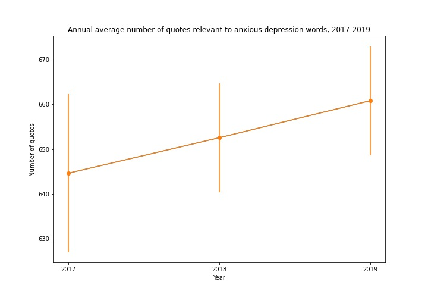

Throughout the decade, depression has become a common mental disorder worldwide with a growing of affected population. As indicated by WHO, approximately 3.8% of population, 280 million, suffered from depression. Among all, 10.7% of adults and 15% of young people has reported depressive emotion, with 70% of them take anxiety and depression as their major problems in US. 

As depression is one of the priority conditions covered by WHO for its severeness and high prevalence rate, we would like to focus our research on analysis of the potential factors that affect depression.

## How can we tell the depression?
A growing body of evidence shows that people with depression use language differently. Many studies have unveiled a class of words that can help accurately predict whether someone is suffering from depression. The most robust language marker of depression is the frequency of using first-person singular pronouns, such as I and my. Moreover, specific negative descriptors are linked to the tendency of depression.

Under this context, we have applied **sentiment analysis** to automatically sort text data from Quotebank by positive, negative, and neutral sentiments. The further goals of our project are 
1. Analyzing if there is a growing awareness of mental disorder
2. Analyzing the seasonal effect on negative emotions
3. Analyzing gender effect in negative emotions

## Method
To look into this topic, we analyzed the dataset from [Quotebank](./another-page.html), which is a corpus of quotations from a decade of news. We focused on the data from 2017 to 2020, since the data in 2016 is not equally distributed and only covers until April in 2021. For all the analysis, we randomlly collect 1 million quotes from 2017, 2018, and 2019 for 30 times to decrease bais and variation. The detailed analytic methods are describled below and shown in Fig.2.

## Our Discoveries
### Growing Awareness
It is only until recently that people started to be more and more aware of mental condition. **Many surveys show that public concern about mental health has increased in recent years.** Therefore, we are going to figure out if there is a growing attention to mental condition in society as the disorder prevails by the following keywords: **mental illness, psychopath, depression, mental disorder**.
<awareness align="center" width="100" height="100" src="assets/images/awareness.jpeg">
  

### Seasonal Effect
##### What is SAD?
Seasonal affective disorder (SAD) is a type of depression that's related to changes in seasons —symptoms start in the fall and continue into the winter months, sapping your energy and making you feel moody. These symptoms often resolve during the spring and summer months
##### Cause
- Neurotransmitter regulation issues: People with SAD may have trouble regulating serotonin
- Melatonin Overproduction: Darkness increases production of melatonin, which regulates sleep. As winter days become shorter, melatonin production increases, leaving people with SAD to feel sleepier and more lethargic, often with delayed circadian rhythms.
- Vitamin D Underproduction: People with SAD also may produce less Vitamin D, which is believed to help with serotonin activity.
- SAD and other forms of depression is exercise and physical activity, but these may be difficult to instigate due to lack of motivation and the cold temperatures in the winter.

.png).png).png).png)
 

### Gender Effect
**Women are more prone to depression and moody swings.** So we want to identify these 2 phenomenon by calculating the female group’s 
- variation of sentiment polarity over time 
- mean of sentiment polarity over time 
And compare the results with the parameters in male group.

## Conclusions

### Reference
