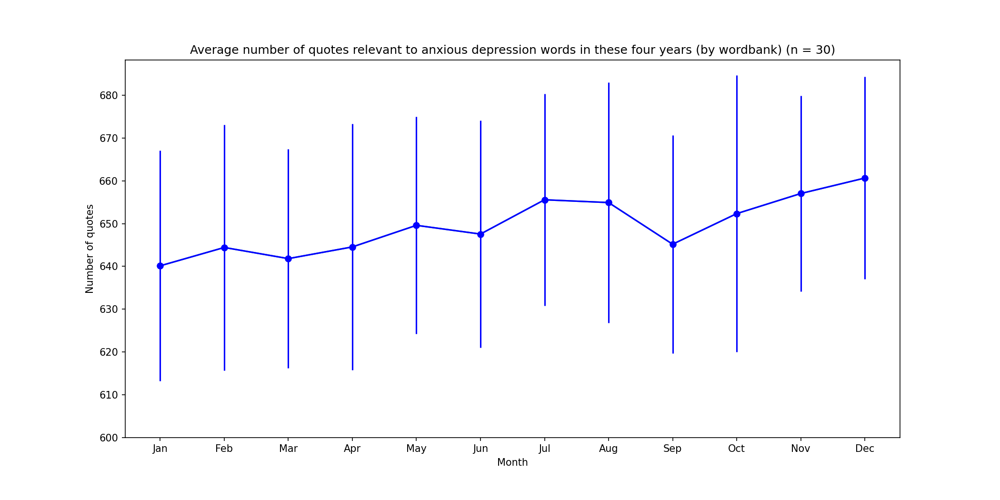
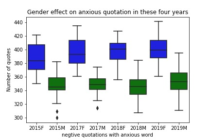

Throughout the decade, depression has become a common mental disorder worldwide with a growing of affected population. As indicated by WHO, approximately 3.8% of population, 280 million, suffered from depression. Among all, 10.7% of adults and 15% of young people has reported depressive emotion, with 70% of them take anxiety and depression as their major problems in US. 

As depression is one of the priority conditions covered by WHO for its severeness and high prevalence rate, we would like to focus our research on analysis of the potential factors that affect depression.

## How can we tell the depression?
A growing body of evidence shows that people with depression use language differently. Many studies have unveiled a class of words that can help accurately predict whether someone is suffering from depression. The most robust language marker of depression is the frequency of using first-person singular pronouns, such as I and my. Moreover, specific negative descriptors are linked to the tendency of depression.

Under this context, we have applied **sentiment analysis** to automatically sort text data from Quotebank by positive, negative, and neutral sentiments. The further goals of our project are the following, also shown in Fig.1.
1. Analyze the trend of negative experience
2. Analyze the seasonal effect on negative emotions
3. Analyze gender effect on negative emotions

## Method
To look into this topic, we analyzed the dataset from [Quotebank](./another-page.html), which is a corpus of quotations from a decade of news. We mainly focused on the data from 2015 to 2019(excluding 2016 since the data in 2016 is not equally distributed in each month) and in 2020, it only covers until April. In this project, we applied two libraries, **[TextBlob](https://pypi.org/project/textblob/0.9.0/)** and **[gender-guesser](https://pypi.org/project/gender-guesser/)**, to analyze the dataset. 

TextBlob is a Python library for prossing textual data, is useful for sentiment analysis by a pre-defined dictionary classifying negative and positive words. TextBlob assigns a score, between [-1, 1] to each word in a sentence, then by operations, for example, multipys and takes average, to get the final results. TextBlob returns polarity and subjectivity of a sentence which we can further analyze. Gender-guesser predicts the gender of a given first name with six different output: unknown (name not found), andy (androgynous), male, female, mostly_male, or mostly_female. In our project, we take male and mostly_male as man, female and mostly_female as women, while discard the data that gives output as unknown and andy.

For all the analysis, we randomlly collect 1 million quotes from 2017, 2018, and 2019 for 30 times to decrease bais and variation. A 
schematic diagram of our analysis process is shown in Fig.2 and the detailed analytic methods are describled in the [Github](./another-page.html).

## Our Discoveries
### A Growing Trend of Negative Emotion 
In addition to the growing population that suffers from depression, a survey from [Gallup Analytics](https://hcabarbieri.it/2021/07/21/2020-was-the-year-of-negative-emotions-poll-finds/) also pointed out that the negative experience index has been increasing year by year from 2015 to 2020. With the Quotebank dataset from 2015 to 2019, we tried to reproduce and look into this phenomenon deeper with both negative words and polarity analysis.

According to our analysis of the 60 negative words over years, we found that from 2015 to 2019 (not including 2016), in general, the negative count increases year by year. Although the error bar of each year overlaps greatly (especially 2015 and 2017), if we compare only 2015 and 2019, a slightly increase can be observed. We suggested the reason behind this is that 60 words are too few for such a big dayaset, if we include more negative words, we might see this growing trend clearer and more specifically.

Overall, our analysis results based on quotebank data are consistent with the survey from Gallup Analytics.

### Is there Seasonal Affective Disorder 
Seasonal affective disorder (SAD) is a type of depression that's related to changes in seasons —symptoms start in the fall and continue into the winter months, sapping your energy and making you feel moody. While these symptoms often resolve during the spring and summer months. It is said that SAD is led by neurotransmitter disorder, melatonin Overproduction, vitamin D underproduction, as well as lack of physical activity, etc.

Since the Quotebank dataset includes quotes throughout the year over decades, we assumed that it would be interesting to oberve the seasonal affective disorder (SAD). We analyzed the number of quotes containing negative words in 2015, 2017, 2018, and 2019, and the changes in polarity scores over the months.

**1. Number of negative words quotes over year**

In the sentiment analysis that takes 10,000 random numbers every month, there are about 575-725 quotes containing negative words every month, that is to say, about 5-7% of quotes associates with anxious every month depression related words. With the analysis of negative words, we could not state any trend or difference between each months. This could also result from the fact that the 60 negative words appear too few in the quote that they can barely make difference. Yet, another possible reason could be that the nature of the quotes from Quotebank are not suitable for this study.

**2. Polarity scores varies over year**

In the sentiment analysis of 10,000 random numbers taken every month, we analyze the polarity over time for negative quotes (polarity <=0 ). In general, the polarity scores fall between -0.08 and -0.07, which indicate the overall negative emotions are just slightly in these 4 years.

To sum up, compared with analyzing the changes of negative words quotes over year, the changes in polarity scores over year are more pronounced. This could be because that when we analyze the number of negative words quotes over year, only specific quotes contain negative words in our defined list are counted. However, when we analyze the polarity scores of the quotes, TextBlob is compared to NLTK training set, so the negative words considered are broader. Also, TextBlob uses a weighted average sentiment score over all the words in each sentence.

### Gender Effect
Accordig to research over the years, it is believed that **women are more prone to depression and mood swings.** To figure out this issue, we made use of Quotebank, which contains quotes from both men and women, and tried to identify these two phenomena by calculating and comparing the **variation and mean of sentiment polarity** over time between male and feamale group.

Whether analyzing all sentences or only analyzing the sentences that are neutral or negative (polarity<=0), we can observe the following two phenomena:

1. In 2015, 2017, 2018, and 2019, the ratio of gender saying negative quotes is 1:1.1 (men: women), which means that more negative quotes come from women every year.
2. The number of negative quotes from women is increasing year by year:
 In 2015, for every 1500 negative quotes, only (650-750) negative quotes came from women. However, in 2019, there were (700-775) negative quotes that came from women, which is about 1.05 times of that in 2015.

## Conclusions
We randomly sampled millions of data per year based on the data in 2015, 2017, 2018, and 2019 and considered bootstrapping method, sentiment analysis, and the classification of the gender. The conclusions of our project are as follows:
**1. There is a growing trend of negative emotion.**
We found that the quotes of negative words have been increasing year by year since 2015, reaching the highest value in 2019
**2. Seasonal effect**
Overall, we could not tell the seasonal effect 
(a) Number of negative quotes: The ratio of negative quotes to all quotes is 5-7% regardless of the season.
(b) Polarity scores vary in the year: Regardless of the season, the negative polarity scores fall from -0.08 to -0.07, indicating only a mild negative tendency among these years.
3. Gender differences in negative emotions
(a) The ratio of males to females who spoke negatively is about 1:1.1. That is to say, girls are more negatively inclined, which is consistent with the scientific fact-Women Are More Prone to Depression.
(b) From 2015 to 2019, there has been a gradual increase in female negative quotes. The number of female negative speeches in 2019 is 1.05 times in 2015.

### Reference
